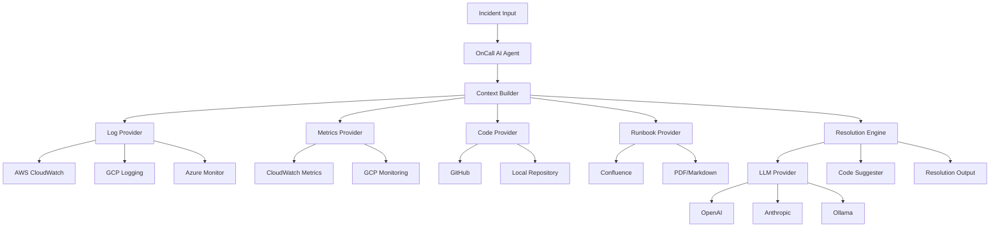

# OnCall AI Agent

> AI-powered incident resolution for DevOps teams - Open source, modular, and community-driven

[](https://opensource.org/licenses/MIT)

## What is OnCall AI Agent?

OnCall AI Agent is an **open-source, modular AI-powered system** that helps DevOps teams resolve incidents faster by:

- **Analyzing logs** from multiple cloud providers (AWS, GCP, Azure) or local files
- **Reading metrics and alarms** from monitoring systems
- **Understanding your codebase** through GitHub integration or local repositories
- **Leveraging runbooks** from various sources (PDF, Markdown, Confluence, Notion)
- **Suggesting specific fixes** with exact code changes and resolution steps
- **Learning from incidents** to improve future responses

## Key Features

### **Modular Architecture**
- **Plug-and-play integrations** - Use any combination of log providers, code repositories, and LLM providers
- **Abstract base classes** - Easy to extend with custom integrations
- **Plugin system** - Add preprocessing/postprocessing logic without touching core code

### **LLM Provider Support**
| Provider | Status |
|----------|--------|
| **OpenAI** | Planned |
| **Anthropic** | Planned |
| **Azure OpenAI** | Planned |
| **Google Gemini** | Planned |
| **AWS Bedrock** | Planned |
| **Ollama** | Planned |
| **HuggingFace** | Planned |

### **Comprehensive Integrations**
| Category | Providers | Status |
|----------|-----------|---------|
| **Logs** | AWS CloudWatch, GCP Logging, Azure Monitor, Local Files | Planned, Planned, Planned, Planned |
| **Metrics** | AWS CloudWatch, GCP Monitoring, Azure Monitor | Planned, Planned, Planned |
| **Code** | GitHub, Local Repository | Planned, Planned |
| **Runbooks** | PDF, Markdown, Confluence, Notion | Planned, Planned, Planned, Planned |

### **Multiple Interfaces**
- **REST API** - Integrate with existing tools and workflows (Planned)
- **CLI Tool** - Quick incident resolution from command line (Planned)
- **Python SDK** - Embed in your applications (Planned)
- **Docker Ready** - Easy deployment with containers (Planned)

## Quick Start

### Installation

Currently in development. Installation methods will be available soon:

```bash
# Coming soon - Install from PyPI
pip install oncall-ai-agent

# Coming soon - Install with specific integrations
pip install oncall-ai-agent[aws,github,openai]

# For now - Install from source
git clone https://github.com/monaal/oncall-ai-agent.git
cd oncall-ai-agent
pip install -e .
```

### Basic Usage

**Coming soon!** The following interfaces are currently in development:

#### Python SDK (In Development)
```python
# Will be available soon
from oncall_agent import OnCallAgent

agent = OnCallAgent(config_file="config.yaml")
resolution = await agent.resolve_incident(
    issue="Service returning 500 errors after deployment",
    logs="ERROR: Database connection timeout",
    service_name="user-service"
)
```

#### CLI Tool (In Development)
```bash
# Will be available soon
oncall-agent resolve \
  --issue "Database connection errors" \
  --logs "ERROR: Connection timeout" \
  --service "user-service"
```

#### REST API (In Development)
```bash
# Will be available soon
curl -X POST "http://localhost:8000/api/v1/incidents/resolve" \
  -H "Content-Type: application/json" \
  -d '{"issue_description": "Service errors", "log_trace": "ERROR: ..."}'
```

### Configuration

Configuration system is in development. Here's the planned structure for `config.yaml`:

```yaml
# Core configuration
integrations:
  # Log provider
  log_provider:
    type: "aws_cloudwatch"  # or "local_files"
    config:
      region: "us-west-2"
      log_groups: ["user-service", "api-gateway"]
      # For local files:
      # log_directory: "/path/to/logs"
      
  # Metrics provider  
  metrics_provider:
    type: "aws_cloudwatch"
    config:
      region: "us-west-2"
      
  # Code repository
  code_provider:
    type: "github"  # or "local_repository"
    config:
      token: "${GITHUB_TOKEN}"
      repositories: ["myorg/user-service", "myorg/shared-libs"]
      # For local repository:
      # repository_path: "/path/to/your/code"
      
  # LLM provider
  llm_provider:
    type: "openai"  # or "anthropic", "ollama"
    config:
      api_key: "${OPENAI_API_KEY}"
      max_tokens: 2000
      
  # Runbook sources (optional)
  runbook_provider:
    type: "confluence"
    config:
      base_url: "https://myorg.atlassian.net"
      username: "${CONFLUENCE_USER}"
      api_token: "${CONFLUENCE_TOKEN}"
      space_key: "RUNBOOKS"

# Plugin configuration
plugins:
  preprocessing:
    - name: "log_sanitizer"
      enabled: true
      config:
        remove_pii: true
        
  postprocessing:
    - name: "response_formatter"
      enabled: true
      config:
        format: "markdown"

# API settings
api:
  host: "0.0.0.0"
  port: 8000
  cors_origins: ["*"]
  rate_limit: "100/minute"
```

## Documentation

| Section | Description |
|---------|-------------|
| [Getting Started](docs/getting-started.md) | Installation, setup, and first incident resolution |
| [Architecture](docs/architecture.md) | System design and component overview |
| [API Reference](docs/api-reference.md) | Complete API documentation |
| [Integrations](docs/integrations/) | All supported integrations and setup guides |
| [Plugins](docs/plugins/) | Plugin development and examples |
| [Deployment](docs/deployment/) | Docker, Kubernetes, and cloud deployment |

## Development & Contributing

We welcome contributions! This project is designed to be community-driven.

### Quick Development Setup

```bash
# Clone the repository
git clone https://github.com/monaal/oncall-ai-agent.git
cd oncall-ai-agent

# Development scripts coming soon
# ./scripts/setup-dev.sh
# ./scripts/run-tests.sh

# Core functionality in development
# oncall-agent serve --config config.yaml --reload
```

### How to Contribute

1. **Found a bug?** [Open an issue](https://github.com/monaal/oncall-ai-agent/issues/new?template=bug_report.md)
2. **Have an idea?** [Request a feature](https://github.com/monaal/oncall-ai-agent/issues/new?template=feature_request.md)  
3. **Want to add an integration?** [Integration request](https://github.com/monaal/oncall-ai-agent/issues/new?template=integration_request.md)
4. **Improve docs?** Documentation PRs are always welcome!

### Contribution Areas

| Area | Difficulty | Impact |
|------|------------|---------|
| **New integrations** (Azure, GCP, etc.) | Medium | High |
| **LLM providers** (Local models, etc.) | Low | High |
| **Plugins** (Custom processors) | Low | Medium |
| **Monitoring & observability** | Medium | Medium |
| **Documentation & examples** | Low | Medium |
| **Tests & CI/CD** | Low | Low |

See [CONTRIBUTING.md](.github/CONTRIBUTING.md) for detailed guidelines.

## Architecture Overview



## Security

- **Secure credential handling** - Environment variables and secure vaults
- **Input validation** - All inputs are validated and sanitized  
- **Rate limiting** - Built-in protection against abuse
- **Audit logging** - Full audit trail of all actions

See [SECURITY.md](SECURITY.md) for security policy and reporting vulnerabilities.

## Roadmap

### Phase 1 - Core Foundation (Current)
- [x] Project structure and architecture design
- [x] Abstract base classes and plugin system
- [x] AWS CloudWatch integration (logs and metrics)
- [x] Azure Monitor integration (logs and metrics)
- [x] GCP Cloud integration (logging and monitoring)
- [x] GitHub integration (repository and code analysis)
- [x] Runbook integration (PDF, Markdown, DOCX, Web)
- [x] LLM provider implementations (OpenAI, Anthropic, Ollama via LangChain)
- [ ] CLI and API interfaces
- [ ] Core AI agent and resolution engine (LangGraph workflows)

### Phase 2 - Expansion
- [ ] Additional code repository support (Bitbucket, local Git)
- [ ] Additional local model support
- [ ] Advanced runbook integrations (Confluence, Notion)
- [ ] Plugin marketplace
- [ ] Incident learning and feedback loops
- [ ] Local file and directory monitoring

### Phase 3 - Advanced Features  
- [ ] Multi-tenant support
- [ ] Advanced analytics and reporting
- [ ] Integration with incident management tools (PagerDuty, Opsgenie)
- [ ] Automated fix deployment (with approval workflows)
- [ ] Custom model fine-tuning

## Usage Examples

### Real-world Scenarios

#### Database Connection Issues
```python
resolution = await agent.resolve_incident(
    issue="Users unable to login - 500 errors",
    logs="""
    ERROR: Connection to database failed
    java.sql.SQLException: Connection timed out
    at com.myapp.db.ConnectionPool.getConnection(ConnectionPool.java:45)
    """,
    service_name="auth-service"
)
# Output: Suggests connection pool configuration changes
```

#### High Memory Usage
```python  
resolution = await agent.resolve_incident(
    issue="Service consuming excessive memory",
    logs="WARN: Memory usage at 95%, GC pressure high",
    service_name="data-processor"  
)
# Output: Identifies memory leaks and suggests code optimizations
```

#### API Rate Limiting
```python
resolution = await agent.resolve_incident(
    issue="Third-party API calls failing",
    logs="HTTP 429: Rate limit exceeded for api.example.com",
    service_name="integration-service"
)
# Output: Suggests implementing exponential backoff and caching
```

## Why OnCall AI Agent?

### **For DevOps Teams**
- **Faster resolution** - Reduce MTTR from hours to minutes
- **Knowledge retention** - Capture and reuse tribal knowledge
- **Consistent responses** - Standardized incident handling
- **Continuous learning** - Improve with each incident

### **For Developers**  
- **Easy integration** - Modular design fits any stack
- **Customizable** - Plugin system for specific needs
- **Well documented** - Comprehensive guides and examples
- **Community driven** - Active community support

### **For Organizations**
- **Cost effective** - Open source with optional enterprise features
- **Secure** - Self-hosted option for sensitive environments  
- **Observable** - Built-in metrics and monitoring
- **Compliant** - Audit trails and access controls

## Acknowledgments

- **OpenAI & Anthropic** for powerful LLM APIs
- **FastAPI** for the excellent web framework
- **boto3** for AWS integrations
- **PyGithub** for GitHub API access
- All our [contributors](https://github.com/monaal/oncall-ai-agent/graphs/contributors)

## License

This project is licensed under the MIT License - see the [LICENSE](LICENSE) file for details.

## Links

- **Documentation**: [docs/](docs/)
- **Issues**: [GitHub Issues](https://github.com/monaal/oncall-ai-agent/issues)
- **Discussions**: [GitHub Discussions](https://github.com/monaal/oncall-ai-agent/discussions)
- **PyPI**: Coming soon
- **Docker Hub**: Coming soon

---

<p align="center">
  <strong>If this project helps you, please consider giving it a star!</strong>
</p>

<p align="center">
  Built with care by the open source community
</p>